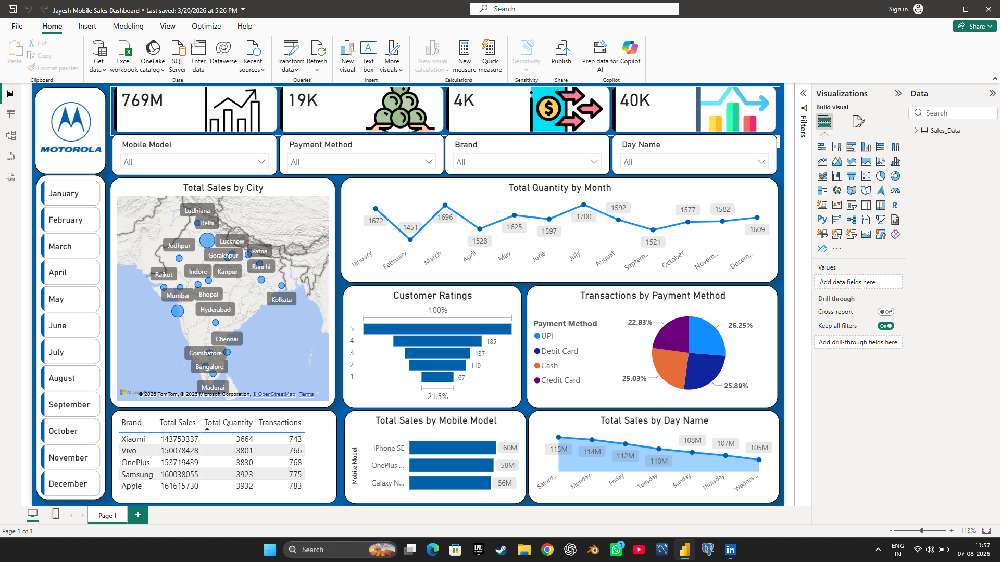

# 📱 Mobile Sales Dashboard | Power BI

## 📌 Project Overview

The Mobile Sales Dashboard is an interactive Power BI project designed to analyze mobile sales performance across different brands, cities, payment methods, and time periods. It helps businesses monitor key performance indicators (KPIs), identify sales trends, and make data-driven decisions using interactive visualizations.

---

## 🎯 Objectives

- Analyze overall mobile sales performance.
- Monitor monthly sales and quantity trends.
- Compare sales across different cities.
- Evaluate customer ratings and payment methods.
- Identify top-performing mobile brands and models.

---

## 🛠️ Tools & Technologies

- **Power BI**
- **Power Query**
- **DAX**
- **Microsoft Excel**

---

## 📊 Dashboard Features

- 📈 Total Sales, Quantity, Transactions & Average Sales KPIs
- 🗺️ Sales by City (Map Visualization)
- 📅 Monthly Sales Trend Analysis
- 📱 Mobile Model-wise Sales Analysis
- ⭐ Customer Rating Analysis
- 💳 Payment Method Distribution
- 📆 Sales by Day of the Week
- 🔍 Interactive Slicers for:
  - Mobile Model
  - Brand
  - Payment Method
  - Day Name
  - Month

---

## 📷 Dashboard Preview

---

## 📂 Project Files

| File | Description |
|------|-------------|
| `Jayesh_Mobile_Sales_Dashboard.pbix` | Power BI Dashboard File |
| `Jayesh_Mobile_Sales_Dashboard.png` | Dashboard Screenshot |
| `README.md` | Project Documentation |

---

## 📈 Key Insights

- Identified top-performing mobile brands and models.
- Tracked monthly sales and quantity trends.
- Compared city-wise sales performance.
- Analyzed customer ratings and preferred payment methods.
- Built an interactive dashboard for business decision-making.

---

## 🚀 Skills Demonstrated

- Data Cleaning
- Data Transformation
- Data Visualization
- Dashboard Design
- Power Query
- DAX
- Business Intelligence
- KPI Reporting

---

## 👨‍💻 Author

**Jayesh Jadhav**

---

⭐ If you found this project useful, don't forget to **Star** this repository.
